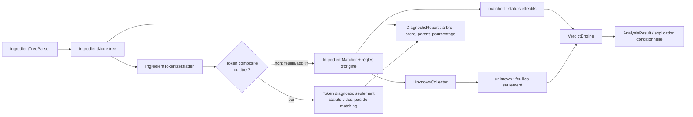

# Audit 0.6.9.9 — propagation de statut des compositions imbriquées

Date : 2026-09-26  
Branche auditée : `master`  
Périmètre : lecture seule, hors création de ce rapport.

## Décision

**NO-GO** pour propager ou persister un statut métier depuis les enfants vers un nœud `COMPOSITE`, et pour l’utiliser dans le verdict.

Le comportement utile de l’intuition est déjà couvert au niveau approprié : `VerdictEngine` agrège globalement tous les statuts effectifs des feuilles et additifs, quelle que soit leur profondeur. Introduire un statut synthétique sur le parent serait redondant dans les cas simples, mais créerait une seconde représentation métier susceptible de diverger des feuilles, des règles d’origine et de `VerdictEngine`.

Une évolution future peut recevoir un **GO conditionnel** uniquement si elle se limite à une *vue de diagnostic ou de présentation*, explicitement nommée comme résumé des descendants, sans écrire dans `IngredientNode`, `IngredientToken`, `AnalysisResult.matched`, `unknown`, les agrégats structurés existants ni le calcul de verdict. Elle doit être précédée des tests manquants listés plus bas.

## Sources examinées

- Consignes locales : `AGENTS.md`.
- Hotfixes et revues : `REVIEW_0_6_9_7_UNCERTAIN_UNKNOWN_VISIBILITY.md`, `REVIEW_0_6_9_7_STRUCTURED_UNKNOWN_CONSISTENCY.md`, `REVIEW_0_6_9_8_NESTED_UNKNOWN_CONTEXT.md`, `FIX_0_6_9_7_UNCERTAIN_UNKNOWN_VISIBILITY_REPORT.md`, `FIX_0_6_9_8_NESTED_UNKNOWN_CONTEXT_REPORT.md`.
- Documentation : `docs/architecture.md`, `docs/parsing.md`, `docs/matching.md`, `docs/verdict.md`, `docs/diagnostic.md`.
- Implémentation : `IngredientTreeParser.kt`, `IngredientTokenizer.kt`, `VeganAnalyzer.kt`, `VerdictEngine.kt`, `DiagnosticModels.kt`, `DiagnosticReport.kt`, `UnknownCollector.kt`, `OriginQualifierRules.kt`.
- Tests : `IngredientTreeParserTest.kt`, `HierarchyAnalysisTest.kt`, `VerdictExplanation069Test.kt`, `CrossContactTest.kt`, `LabelSectionExtractorTest.kt`, `Version0510Test.kt`, `Version0511Test.kt`, `Version0591Test.kt`, `UncertainUnknownVisibility097Test.kt` et `VerdictExplanationInstrumentedTest.kt`.

## Cartographie du flux réel

`IngredientTreeParser` construit un arbre purement syntaxique. Un `IngredientNode.COMPOSITE` contient son libellé, son pourcentage éventuel, ses enfants et ses métadonnées ; il ne porte aucun statut. Les parenthèses/crochets deviennent une composition selon des critères structurels. Les qualificatifs protégés, dont une origine reconnue ou `non hydrogénée`, restent dans une feuille.

`IngredientTokenizer.flatten` visite l’arbre en profondeur, attribue un `order` séquentiel et relie chaque enfant à son parent par `parentOrder`. Il conserve `depth`, `quantityPercent`, `childCount`, la classe fonctionnelle et les métadonnées. Les pourcentages restent donc sur le nœud qui les déclare ; ils ne participent pas au verdict.

Dans `VeganAnalyzer`, les tokens `SECTION_HEADING` et `COMPOSITE_INGREDIENT` prennent la branche de diagnostic précoce. Ils reçoivent `baseStatuses = []`, `effectiveStatuses = []`, `matchedIngredientIds = []` et `unknown = null`, puis ne sont jamais transmis au matcher ni à `UnknownCollector`. Seules les feuilles et les additifs reçoivent un matching, une résolution d’origine éventuelle, des statuts de base/effectifs, et éventuellement un inconnu.

Les ingrédients effectifs sont dédupliqués par identifiant dans `found`. Si le même identifiant est rencontré plusieurs fois, `VeganAnalyzer.statusPriority` conserve le statut le plus contraignant : `VEGAN < UNCERTAIN < VEGETARIAN < NON_VEGAN`. Les inconnus des feuilles sont dédupliqués par forme normalisée dans `AnalysisResult.unknown`. Les occurrences, l’ordre et la hiérarchie restent disponibles dans `tokens`, même lorsque les agrégats par identifiant sont dédupliqués.

`VerdictEngine.evaluate(matched, unknown)` est l’unique moteur du verdict détaillé : `NON_VEGETARIAN` s’il existe un `NON_VEGAN`, puis `UNCERTAIN`, puis `INCONCLUSIVE` pour un inconnu ou l’absence d’élément considéré, puis `VEGETARIAN`, enfin `VEGAN`. Ainsi les enfants de tous les composites participent déjà au même agrégat global. Il n’y a aucun calcul de verdict par sous-arbre ni de fusion parent/enfants.

Les règles d’origine (`OriginQualifierRuleSet`) s’appliquent à une feuille/additif correspondant à la cible et à une qualification directement attachée. Elles peuvent rendre un statut effectif `VEGAN`, `VEGETARIAN` ou `NON_VEGAN`. Une origine explicitement non vegan est aussi tracée dans `originNonVeganIngredientIds`, qui force `veganAssessment = NOT_VEGAN` même si le statut effectif reste `UNCERTAIN`. Aucune règle d’origine ne se propage à un conteneur.

`AnalysisDiagnostics.visibleUnknownTokens` est une vue UI/export : elle retire seulement un token inconnu dont les statuts effectifs, non vides, sont tous `VEGAN`; elle ne modifie pas `AnalysisResult.unknown`. Les agrégats `ingredientGroups` et `decision` utilisent cette vue visible. L’explication conditionnelle conserve au contraire le brut `result.unknown` et réutilise `result.verdictWithoutUncertain`, donc `VerdictEngine`; elle ne peut pas transformer un vrai inconnu en résultat conditionnel vegan.

Depuis 0.6.9.8, `VerdictExplanationFormatter` reconstruit le chemin parent → enfant des inconnus visibles par `parentOrder` pour le rendu seulement. Le parent n’est ajouté ni à `unknown`, ni à `matched`, ni aux agrégats structurés, ni au verdict.

Les traces sont extraites avant l’arbre dans `LabelSectionExtractor` / `LabelPreprocessor`, puis conservées dans `crossContactWarnings`. `DiagnosticReport` indique explicitement qu’elles ne sont pas prises en compte. Une section autonome `contient` est analysée séparément comme preuve de présence réelle ; elle peut enrichir `matched` et `declaredPresenceIngredientIds`, sans devenir une liste de composition complète.

## Cas de composites confrontés au code et aux tests

| Cas | Comportement actuel démontré | Tests / preuves | Compatibilité avec la proposition et risque |
|---|---|---|---|
| Tous les enfants `VEGAN` | Les feuilles alimentent `matched`; le verdict global est `VEGAN` si rien d’autre ne le dégrade. Le parent reste sans statut. | `HierarchyAnalysisTest.compositeParentKeepsChildrenAndDoesNotBecomeAFakeUnknown`; `unknownCompositeParentDelegatesToKnownChildren`. | L’effet sur le verdict existe déjà. Persister `COMPOSITE=VEGAN` est redondant et risquerait de classer un libellé parent générique. |
| Un enfant `VEGETARIAN` | Le statut de la feuille entre dans `matched`; `VerdictEngine` donne `VEGETARIAN` sauf statut plus prioritaire. | Priorité dans `VerdictEngine`; couverture de statuts connus dans `VerdictExplanation069Test` et `Version0511Test.establishedIngredientsNestedCompositesAndTracesRemainIndependent`. | L’effet global est déjà présent. Aucun test ne fixe explicitement un parent synthétique `VEGETARIAN`. |
| Un enfant `NON_VEGAN` | Le bloqueur terminal l’emporte sur tous les autres statuts dans le verdict détaillé. | `VerdictEngine`; `IngredientTreeParserTest.animalLeafInsideCompositeStillDeterminesVerdict`; `Version0511Test.establishedIngredientsNestedCompositesAndTracesRemainIndependent`. | Une propagation ne doit jamais pouvoir réduire, filtrer ou remplacer ce bloqueur. Risque bloquant si le parent synthétique sert de raccourci. |
| Un enfant `UNCERTAIN` | Il produit `UNCERTAIN` avant l’examen des inconnus; le verdict conditionnel exclut uniquement les incertains et rappelle le moteur. | `VerdictEngine`; `VerdictExplanation069Test`; `UncertainUnknownVisibility097Test`. | L’effet global existe. Une agrégation locale doit préserver les occurrences et ne pas confondre statut incertain et inconnu. |
| Un enfant réellement inconnu | La feuille est ajoutée à `result.unknown`; le parent composite est exclu. Le verdict est `INCONCLUSIVE` sauf `UNCERTAIN` ou `NON_VEGAN` plus prioritaires; aucun conditionnel vegan/végétarien si le vrai inconnu demeure. | `HierarchyAnalysisTest.nestedHierarchyPreservesEveryParentRelationship`; `IngredientTreeParserTest.regressionLabelBuildsFourRootsAndOnlyUnknownLeaves`; `UncertainUnknownVisibility097Test`; test instrumenté de contexte imbriqué. | L’effet de blocage existe. Une étiquette parent « inconclusive » ne doit pas remplacer ou masquer la feuille inconnue. |
| Parent avec statut/règle d’origine/ambiguïté propre | Un vrai composite n’est pas matché, même si son libellé contient un mot animal; une règle d’origine ne s’applique qu’à une feuille/additif ciblé et qualifié directement. | `HierarchyAnalysisTest.compositeParentWordsDoNotDetermineVerdict`; `Version0511Test.e471OriginClaimsUseOnlyTheExplicitResolutionRegistry`; `OriginQualifierRules.kt`. | Incompatible avec une classification automatique du parent. C’est le principal risque sémantique. |
| Imbrication sur plusieurs niveaux | Préordre stable, `parentOrder`, profondeur, enfant et pourcentage de chaque nœud sont conservés; le contexte parent est rendu visuellement pour un enfant inconnu. | `IngredientTreeParserTest.nestedQuantitiesStayOnTheirOwnCompositeNodes`; `singlePercentageChildKeepsParentAndChildDiagnostics`; `HierarchyAnalysisTest.nestedHierarchyPreservesEveryParentRelationship`; `VerdictExplanationInstrumentedTest.unknownIngredientsUseBulletsAndKeepNestedOccurrenceContext`. | Une vue de résumé doit parcourir uniquement les descendants terminaux et ne pas casser les ordres ou les occurrences. |
| Classe fonctionnelle (`épices`, `épaississants`, `émulsifiant`) | La classe est du contexte syntaxique. Les désignations deviennent des additifs/feuilles matchés; la classe ne fournit aucun statut. | `docs/parsing.md`; `IngredientTreeParserTest.additiveKeepsFunctionalClassOutsideMatcherText`; cas OCR `épaississants` dans `UncertainUnknownVisibility097Test`. | Classer la classe à partir des enfants injecterait une règle métier absente. Risque important. |
| Parenthèse qualificative non compositionnelle | Elle reste une seule feuille et la qualification est résolue sur cette feuille. | `IngredientTreeParserTest.qualificationParenthesisStaysInsideOneLeaf`; `HierarchyAnalysisTest.protectedVegetableOilDesignationDoesNotAnalyzeItsParenthesis`; `Version0591Test.variableProportionsAndAlternativesRemainStructural`. | Il n’existe pas d’enfant à agréger. Une logique fondée sur la ponctuation créerait de faux composites. |
| `contient` réel et traces | `contient` autonome est une preuve séparée; les traces ne deviennent ni tokens ni match ni verdict. | `LabelSectionExtractorTest`; `Version0510Test.declaredPresenceWithoutColonIsEvidenceButTracePhrasesNeverAre`; `HierarchyAnalysisTest.hierarchyNeverConsumesATrailingTrace`; `CrossContactTest`. | Hors logique de propagation. Les inclure serait un défaut bloquant. |

## Ce qui existe, ce qui est partiel, ce qui est absent

- **Existe déjà :** l’agrégation des statuts des descendants pour le verdict global, avec priorité unique dans `VerdictEngine`; le maintien de l’arbre, de `parentOrder`, de la profondeur, des pourcentages et des occurrences; l’affichage parent → enfant des inconnus; le filtrage des faux inconnus effectivement vegan dans les vues visibles.
- **Partiel :** les diagnostics représentent le parent et ses enfants mais n’exposent pas de résumé calculé des descendants par composite. Les tests couvrent de nombreuses combinaisons réelles, mais pas une matrice dédiée qui attendrait un résumé de sous-arbre pour chacune des cinq issues.
- **Absent volontairement :** statut de base/effectif sur `COMPOSITE`; matching, règle d’origine ou collecte d’inconnus sur le composite; verdict par composite; remontée de ce verdict dans `AnalysisResult`.
- **Dangereux :** tout statut synthétique traité comme un `Ingredient`, toute écriture dans `matched`/`unknown`, toute priorité du parent sur les descendants, toute dérivation fondée sur le texte du parent, la classe fonctionnelle ou le rendu UI.

## Risques de sécurité métier

| Niveau | Risque | Pourquoi il est concret |
|---|---|---|
| Bloquant | Masquer un vrai inconnu | 0.6.9.7 protège `result.unknown` brut pour bloquer le conditionnel. Un parent `VEGAN` synthétique, une liste d’inconnus remplacée ou une déduplication parent/enfant mal conçue peut contourner `UNKNOWN_INGREDIENT_REMAINS`. |
| Bloquant | Contourner un `NON_VEGAN` | `VerdictEngine` donne priorité au terminal `NON_VEGAN`; l’analyse ne doit jamais s’arrêter au parent ni substituer un statut agrégé moins contraignant. |
| Bloquant | Faire entrer les traces dans le verdict | Les traces sont volontairement hors arbre et hors `matched`. Une traversée qui part du texte/rendu au lieu de `ingredientTree` ou `tokens` peut les réintroduire. |
| Important | Créer un second moteur | Reproduire la priorité au niveau des composites peut diverger de `VerdictEngine`, de `verdictWithoutUncertain` et des règles d’origine. |
| Important | Classer un parent générique | `sauce au fromage (eau, huile)` est vegan aujourd’hui parce que « sauce au fromage » est un conteneur non classé. Le rendre vegan par ses enfants affirme une nature que l’étiquette n’établit pas. |
| Important | Confondre structure et règle | Classe fonctionnelle, pourcentage, alternatives, nano, parenthèse de qualification et contexte de présentation ne sont pas des preuves de statut. |
| Mineur | Perdre la traçabilité | Une agrégation qui remplace les occurrences ferait disparaître `parentOrder`, les quantités propres et les répétitions affichées depuis 0.6.9.8. |

## Évolution minimale compatible, si un besoin produit explicite apparaît

Ne pas modifier le verdict ni la classification des nœuds. Ajouter seulement une projection dérivée, par exemple `CompositeDescendantSummary`, construite après l’analyse à partir du sous-arbre de `TokenDiagnostic` :

1. elle identifie le composite par `order` et conserve son texte, sa profondeur, son `parentOrder` et son pourcentage;
2. elle lit exclusivement ses descendants terminaux non déclarés comme présence réelle, sans inclure les traces;
3. elle expose des comptes/listes par statut effectif et les inconnus visibles et bruts séparément;
4. si une valeur synthétique est nécessaire à l’affichage, elle est nommée `descendantSummary` ou `derivedDescendantOutcome`, jamais `status` du composite, et elle délègue strictement la priorité à une API unique de `VerdictEngine`;
5. elle n’est consommée que par le diagnostic/UI avec une légende indiquant qu’il s’agit des descendants déclarés, sans modifier le verdict produit.

Cette proposition ne répond pas à une décision de classification autonome du parent : elle évite précisément de l’inventer. En l’absence d’un besoin d’interface défini, ne rien changer est l’option recommandée.

## Tests à prévoir avant toute modification

- Une matrice de résumé pour un composite contenant exclusivement des enfants vegan, puis exactement un enfant `VEGETARIAN`, `NON_VEGAN`, `UNCERTAIN`, et un vrai inconnu, avec les verdicts globaux existants inchangés.
- Des cas combinés prouvant les priorités : `NON_VEGAN + UNCERTAIN + inconnu`, `UNCERTAIN + inconnu`, et enfant connu plus parent générique ambigu.
- Un composite à trois niveaux avec pourcentages à chaque niveau, répétitions du même ingrédient et vérification inchangée de `order`, `parentOrder`, profondeur, occurrences et rendu parent → enfant.
- Un E471/E322 qualifié par origine au sein d’un composite, incluant une origine explicitement non vegan, pour prouver que le résumé lit les statuts effectifs et n’écrase pas `originNonVeganIngredientIds`.
- Classes fonctionnelles avec plusieurs additifs, `amidon modifié`, proportions variables, alternatives et parenthèses qualificatives, pour prouver qu’aucun faux composite n’est créé.
- `contient` autonome, `contient` imbriqué, et toutes formes de traces adjacentes/multilingues, avec égalité stricte des verdicts avant/après.
- Vérifications structurées que `AnalysisResult.matched`, `unknown`, `ingredientGroups`, `decision`, `verdictExplanation` et `DiagnosticReport` conservent leurs contrats actuels si la vue est seulement informative.

## Limites hors scope

- Enrichissement de `ingredients.json`, alias et corrections OCR.
- Changement des heuristiques de parsing des parenthèses/crochets.
- Nouvelle politique sur les classes fonctionnelles ou les qualifications d’origine.
- Modification de l’interface, des textes localisés, des traces ou de la présence réelle.
- Décision réglementaire sur la signification d’un libellé parent générique.

## Validation et état Git final

Contrôles lecture seule exécutés avant création du présent rapport :

- `git status --short` : vide.
- `git diff --check` : succès, sans sortie.
- `git diff --stat` et `git diff` : sans sortie.
- `git log --oneline` : les commits de hotfix attendus sont présents, notamment `80d369d` (agrégats d’inconnus) et `dc96ede` (contexte imbriqué).
- `rg` ciblé sur le parseur, tokenizer, analyseur, moteur, diagnostics, origine, explication, composites, `contient` et traces.
- `./gradlew :mutation-core:test --console=plain` : succès (tâches à jour).

Après création, le seul changement attendu du worktree est `COMPOSITE_STATUS_PROPAGATION_AUDIT_0_6_9_9.md`.

Confirmation : aucun code, test existant, donnée, asset, ressource, Gradle, documentation existante, index Git, commit ou push n’a été modifié pendant cet audit. Seul ce rapport a été créé.
