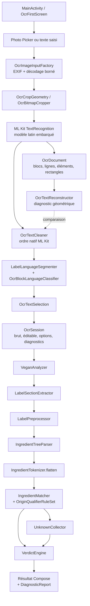

# Architecture générale

Le projet contient un unique module Android `:app`. Les classes applicatives sont regroupées dans `com.example.isitvegan`, avec le thème Compose dans `com.example.isitvegan.ui.theme`. Il n’existe ni couche réseau métier, ni base SQL, ni service distant.

## Flux actif

L’analyse rappelle `LabelLanguageSegmenter` dans `VeganAnalyzer`. Cette seconde segmentation est volontairement indépendante de l’acquisition : les modes texte et OCR passent ainsi par le même moteur.

## Responsabilités

| Zone | Composants principaux | Responsabilité |
|---|---|---|
| Entrée/UI | `MainActivity`, `OcrFirstScreen`, `UiLanguage` | état Compose, sélection de photo, édition, lancement de l’OCR et de l’analyse |
| Image | `OcrImageInputFactory`, `OcrImageSizing`, `OcrCropGeometry`, `OcrBitmapCropper` | décodage borné, EXIF, viewport, gestes et bitmap recadré |
| OCR | `OcrProcessor`, `OcrModels`, `OcrTextReconstructor`, `OcrTextCleaner` | ML Kit, conservation de la structure, reconstruction diagnostique et nettoyage |
| Langue | `LabelLexicon`, `LabelLanguageSegmenter`, `OcrBlockLanguageClassifier`, `OcrTextSelection` | marqueurs, titres, score de qualité, préférence et choix du bloc éditable |
| Sections | `LabelSectionExtractor`, `LabelPreprocessor` | composition, présence réelle, traces, notes et sections ignorées |
| Syntaxe | `IngredientTreeParser`, `FunctionalClassLexicon`, `IngredientTokenizer` | arbre d’ingrédients et aplatissement compatible avec l’analyse |
| Connaissance | `IngredientMatcher`, `OriginQualifierRuleSet`, `ingredients.json` | normalisation, alias, numéros E et qualifications d’origine |
| Décision | `UnknownCollector`, `VerdictEngine`, `AnalysisResult` | inconnus, compatibilité vegan et classification détaillée |
| Diagnostic | `DiagnosticReport`, `OcrExportReport` | rapports texte partageables à l’initiative de l’utilisateur |

## État et concurrence

`MainActivity` charge les deux assets de connaissance via `VeganAnalyzer.loadDatabase` sur `Dispatchers.IO`. Le bouton d’analyse reste désactivé tant que ce chargement n’a pas réussi. `OcrFirstScreen` exécute le décodage sur `Dispatchers.IO` et l’analyse CPU sur `Dispatchers.Default`. `OcrProcessor` possède un `CoroutineScope` supervisé et restitue ses callbacks sur `Dispatchers.Main`.

La session OCR est un objet immutable `OcrSession` gardé par `remember`. Elle contient le texte brut, le texte éditable, les options linguistiques, le diagnostic et les instantanés des analyses. L’URI de la photo n’appartient volontairement pas au modèle de session.

## Composant hérité

`MainActivity.kt` contient encore le composable public `IsItVeganScreen`. Aucune référence du dépôt ne l’appelle : `MainActivity.onCreate` affiche `OcrFirstScreen`. Cette ancienne UI ne doit pas être utilisée comme description du chemin de production actuel, même si ses branches restent couvertes indirectement par le même moteur.

## Frontières importantes

- ML Kit produit la reconnaissance et ses rectangles ; le dépôt ne réimplémente pas un moteur OCR.
- Le parseur construit une structure sans consulter la base d’ingrédients.
- Le matcher classe les feuilles à partir de la base ; il ne corrige pas la syntaxe.
- Les traces et notes restent hors du moteur de verdict.
- L’interface ne transforme jamais une image directement en verdict : elle obtient d’abord un texte éditable.

