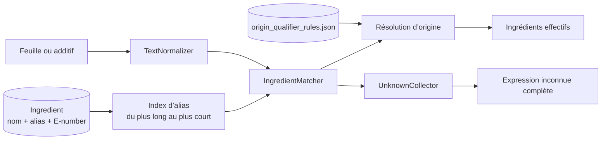

# Matching des ingrédients

Le matching commence après le parsing. `IngredientMatcher` reçoit un `IngredientToken` terminal et une liste d’objets `Ingredient`. Il ne décide pas de la structure et ne traduit pas le texte.

## Normalisation

`TextNormalizer.normalize` :

1. passe en minuscules ;
2. transforme `œ` en `oe` et `æ` en `ae` ;
3. décompose Unicode puis retire les marques diacritiques ;
4. remplace toute suite non alphanumérique par un espace ;
5. normalise un numéro E initial écrit `E 471` en `e471`.

Cette forme sert aux comparaisons. Le texte original reste dans le token et le diagnostic.

## Index des alias

Pour chaque entrée, le matcher indexe :

- le nom canonique ;
- tous les alias ;
- le numéro E lorsqu’il existe.

Les alias normalisés sont triés par longueur décroissante. Les candidats plus précis couvrent donc leur plage avant les alias courts : `lait de coco` peut masquer `lait`. Les correspondances utilisent des bornes alphanumériques pour ne pas trouver un alias au milieu d’un mot.

Un alias court possédant une variante liée plus longue est refusé devant certains connecteurs (`de`, `d`, `du`, `des`, `à`, `au`) si aucune expression complète ne correspond. Cette règle empêche par exemple « farine » de faire correspondre arbitrairement « farine de lin » à l’entrée farine de blé.

## Résolutions

`IngredientMatch.resolution` décrit la qualité du résultat :

| Valeur | Signification |
|---|---|
| `NONE` | aucun alias admissible |
| `EXACT` | toute l’expression normalisée est couverte |
| `COVERED` | le reste ne contient que des qualificatifs revus ou une expression protégée |
| `PARTIAL_CONTEXTUAL` | au moins un ingrédient est trouvé, mais un reste sémantique demeure |
| `BLOCKED_CONFLICT` | un alias animal court a été bloqué dans une expression végétale plus précise |

Quelques formes contrôlées peuvent être couvertes : qualificatifs de préparation (`non hydrogénée`, `en poudre`, `fumé`, etc.), préfixes de dérivation et arôme naturel qualifié. Les formes exactes de « sirop de glucose-fructose » sont également reliées à `glucose_syrup`.

La protection interne de `butter`, `milk` et `cream` évite les conflits lorsque leur alias apparaît dans une expression végétale connue telle que beurre de cacao ou lait de coco. Cette protection dépend toujours d’une autre correspondance vegan précise ; elle n’est pas une règle générale de suppression.

## Qualifications d’origine

`OriginQualifierRuleSet` est chargé depuis `origin_qualifier_rules.json`. Seules les règles marquées `ACTIVE` sont utilisables. En 0.6.4.1, le fichier active les familles E322/lécithines et E471/mono-diglycérides, ainsi qu’une expression protégée pour les huiles végétales.

Une qualification ne s’applique que si :

- sa cible correspond au même ingrédient ;
- elle est attachée par une parenthèse finale ou un suffixe direct autorisé ;
- le statut de base correspond au statut non résolu attendu par la règle.

`lécithines (soja)` peut ainsi devenir vegan et `lécithines (œuf)` végétarien. `E471 d’origine végétale` peut devenir vegan. Une mention distante « huiles végétales » ne résout jamais E471.

Le chargeur valide la version de schéma, les enums, identifiants dupliqués et résultats contradictoires. Toute erreur rejette l’ensemble actif et apparaît dans le diagnostic.

## Inconnus

`UnknownCollector` ne produit aucun inconnu pour `EXACT` ou `COVERED`. Pour `NONE`, `PARTIAL_CONTEXTUAL` et `BLOCKED_CONFLICT`, il conserve l’expression complète lisible du token, et non seulement le résidu. Les inconnus sont dédupliqués par leur forme normalisée dans `VeganAnalyzer`.

Un conteneur composite n’est jamais envoyé au collecteur ; seuls ses enfants peuvent devenir inconnus. Cette règle sépare la qualité du parsing de la couverture de la base.

## Parsing et classification

La distinction est stricte :

- `IngredientTreeParser` répond « quels éléments et quelles relations sont écrits ? » ;
- `IngredientMatcher` répond « quelles entrées connues couvrent cette feuille ? » ;
- `OriginQualifierRuleSet` ajuste éventuellement un statut variable ;
- `VerdictEngine` agrège les statuts et inconnus.

Ajouter un alias dans le parseur ou deviner un statut depuis la syntaxe violerait cette frontière.

