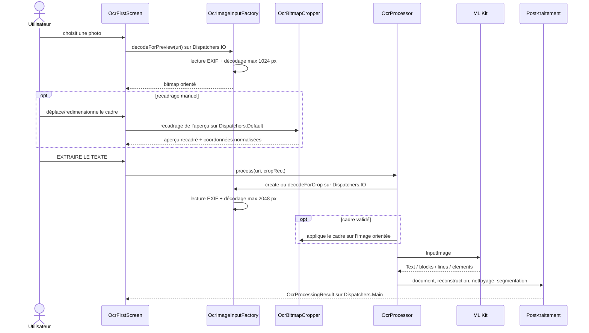

# Pipeline OCR

Le mode OCR est piloté par `OcrFirstScreen`. La photo reste référencée par son `Uri` pendant la composition ; les bitmaps de prévisualisation et de recadrage vivent uniquement en mémoire.

## Séquence réelle

## Acquisition et orientation

Le sélecteur utilise `ActivityResultContracts.PickVisualMedia` et limite le choix aux images. `OcrImageInputFactory` ouvre le flux via `ContentResolver` ; il ne réencode pas le fichier en JPEG et n’écrit rien dans la galerie.

Pour une image entière, `create` :

1. lit `ExifInterface.TAG_ORIENTATION` ;
2. décode un bitmap borné ;
3. transmet à `InputImage.fromBitmap` une rotation de 0, 90, 180 ou 270 degrés ;
4. applique au préalable les orientations miroir, que le simple angle ML Kit ne représente pas.

Pour le recadrage, `decodeForPreview` et `decodeForCrop` appliquent d’abord toute l’orientation EXIF au bitmap. Le rectangle normalisé correspond donc au sens visible. Le bitmap recadré est envoyé à ML Kit avec une rotation de 0 degré.

Si l’EXIF est absent, illisible ou indéfini, l’image entière conserve une rotation de 0 degré et un avertissement est ajouté. Le code n’essaie pas quatre orientations.

## Taille et mémoire

`OcrImageSizing.sampleSize` choisit un facteur de sous-échantillonnage en puissance de deux, puis `decodeScaledBitmap` réduit encore le plus grand côté si nécessaire :

- aperçu : 1024 px maximum, `RGB_565` ;
- OCR et recadrage haute définition : 2048 px maximum, `ARGB_8888`.

L’aperçu est décodé une fois dans un `LaunchedEffect(sourceUri)`, donc pas à chaque recomposition. Le recadrage haute définition n’est créé qu’au lancement de l’OCR. Les anciens aperçus et le bitmap temporaire transmis à ML Kit sont recyclés lorsque leur cycle de vie se termine.

Les erreurs d’accès, de décodage et de mémoire deviennent des messages contrôlés. Une erreur mémoire suggère un recadrage plus serré ; le texte déjà présent dans la session n’est pas remplacé par une exception.

## Recadrage

`OcrCropRect` exprime `left`, `top`, `right` et `bottom` entre 0 et 1. `OcrCropGeometry` :

- maintient le cadre dans l’image ;
- impose une largeur et une hauteur minimales de 0,12 ;
- calcule le viewport réel de l’image sous `ContentScale.Fit` ;
- teste les gestes dans l’ordre coins, bords, intérieur, extérieur ;
- donne aux coins un rayon tactile de 32 dp et aux bords 20 dp dans `OcrCropDialog`.

Les poignées visibles font 8 dp de rayon. La zone extérieure est assombrie et le coin ou bord actif est coloré. Le bouton de réinitialisation remet `cropRect` à `null`, ce qui signifie « image entière ».

## Structure conservée

`OcrProcessor.toOcrDocument` convertit la réponse ML Kit en modèles internes :

- `OcrDocument` : texte brut, orientation et blocs ;
- `OcrBlock` : numéro, ordre ML Kit, rectangle et lignes ;
- `OcrLine` : texte, rectangle, bloc, numéro, ordre ML Kit et éléments ;
- `OcrElement` : texte, rectangle, bloc, ligne et ordre dans la ligne.

Le texte brut de `Text.text` est copié tel quel dans `OcrDocument.rawText`, puis dans `OcrProcessingResult.rawText`. Il ne passe pas par le nettoyeur.

## Reconstruction et ordre natif

`OcrTextReconstructor` peut :

- revenir à l’ordre ML Kit si des coordonnées manquent ;
- regrouper les zones qui se chevauchent verticalement et les trier de gauche à droite ;
- détecter une coupure de colonnes seulement lorsqu’un espace horizontal dépasse 1,5 fois la hauteur moyenne et que les colonnes coexistent verticalement ;
- séparer par une ligne vide deux blocs dont l’écart vertical dépasse 1,5 fois la hauteur moyenne.

Cette reconstruction n’est toutefois **pas** la source du texte analysé en 0.6.5. `OcrProcessor` nettoie `recognized.text`, compare ce résultat à la reconstruction géométrique, puis conserve l’ordre natif ML Kit. Une divergence ajoute l’avertissement « ordre natif ML Kit conservé ; reconstruction géométrique ignorée ».

## Nettoyage déterministe

`OcrTextCleaner.clean` compile ses expressions régulières à l’appel pour qu’une incompatibilité du moteur Android reste interceptable par `OcrProcessor`. Il effectue seulement des transformations bornées :

- fins de ligne CRLF vers LF ;
- réunion d’une coupure avec trait d’union explicite ; le trait est conservé entre deux séquences de majuscules Unicode et supprimé avant une suite en minuscules ;
- correction de `ingrédlents` uniquement lorsqu’il ressemble à un titre français délimité ;
- espaces multiples, ponctuation, deux-points et parenthèses ;
- espace manquant après une virgule ;
- normalisation prudente des titres « ingrédients » et « peut contenir ».

Les tests garantissent notamment la conservation de `11,9 %`, `E471`, `PETIT-LAIT`, des parenthèses imbriquées, des astérisques et des mots inconnus. Il n’existe ni dictionnaire autocorrectif, ni traduction, ni correction probabiliste des nombres.

`cleanSelectedBlock` peut tronquer un bloc sélectionné à partir d’un début de ligne manifestement parasite : « open here », « ouvrir ici », importateur/importer/imported by ou certification/certified.

## Session et échecs

`OcrSession` conserve séparément :

- `rawOcrText`, sortie originale ML Kit ;
- `editableText`, bloc sélectionné et nettoyé ;
- `fullOcrText`, texte nettoyé complet ;
- les options linguistiques et le choix courant ;
- le diagnostic OCR ;
- les instantanés exacts des analyses déjà lancées.

Une nouvelle photo, un nouveau cadre ou une sélection linguistique invalide les analyses précédentes. Une modification manuelle du texte invalide l’affichage courant, mais les anciens instantanés restent dans l’export jusqu’à la remise à zéro de la session.

Si le post-traitement lance une `RuntimeException`, `OcrProcessor` rend le texte brut éditable, marque `usedRawFallback` et ajoute un avertissement. Les échecs ML Kit produisent un message de saisie manuelle. `close` annule le scope et ferme le recognizer.

## Limites constatables

- Le recognizer configuré est uniquement `TextRecognizerOptions.DEFAULT_OPTIONS`, donc le script latin.
- Une image sans EXIF exploitable n’est pas redressée par analyse visuelle.
- Il n’existe pas de correction de perspective.
- La reconstruction géométrique n’alimente pas actuellement le texte analysé.
- Le vocabulaire de reclassification linguistique est volontairement court et orienté ingrédients courants.
- Un recadrage trop serré ou la limite de 2048 px peut supprimer des détails fins ; l’utilisateur garde l’aperçu et le texte brut pour vérifier.
