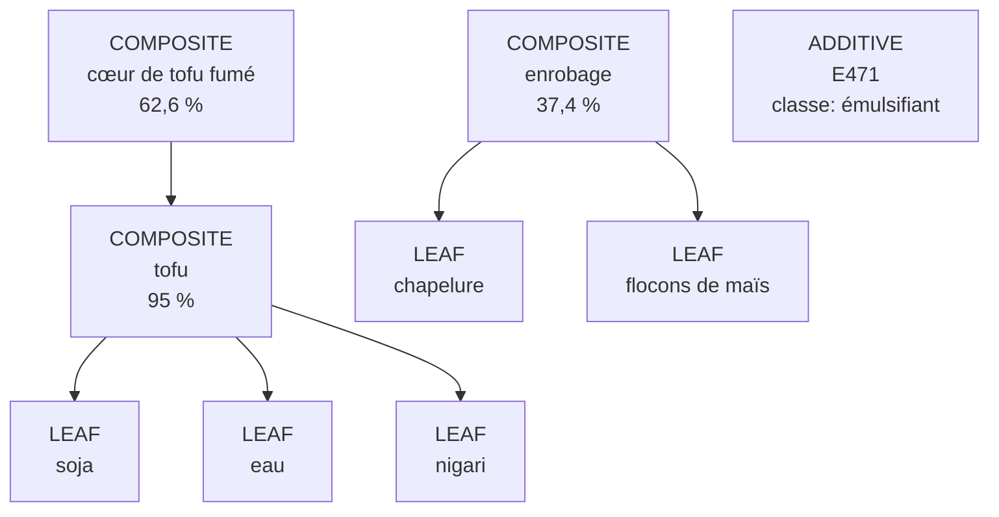

# Parsing des ingrédients

`IngredientTreeParser` transforme une composition en arbre sans consulter `ingredients.json`. Cette séparation est essentielle : une erreur de structure et une absence dans la base sont deux problèmes différents.

## Modèle

Chaque `IngredientNode` contient le texte brut nettoyé, sa forme normalisée et des métadonnées : quantité, classe fonctionnelle, nanoforme, proportions variables, alternatives, qualification d’origine, type et enfants.

Les trois types sont :

| Type | Rôle |
|---|---|
| `LEAF` | ingrédient terminal envoyé au matcher |
| `COMPOSITE` | conteneur avec sous-ingrédients ; le conteneur lui-même n’est pas classé |
| `ADDITIVE` | désignation suivant une classe fonctionnelle, par exemple `E471` après « émulsifiant » |

`isSectionHeading` distingue les titres de recette tels que « Farce 63 % : ». Ils structurent leurs enfants mais ne deviennent ni correspondances, ni inconnus.

## Séparation syntaxique

Le parseur parcourt le texte en tenant compte de la profondeur des parenthèses et crochets. Les virgules, points-virgules, retours à la ligne et fins de phrase ne séparent qu’à profondeur zéro. Une virgule entre deux chiffres reste une virgule décimale.

Les crochets forment une composition. Une parenthèse devient une sous-composition lorsqu’elle contient notamment plusieurs éléments, une structure imbriquée, un préfixe `contient`, un sigle tout en majuscules ou un mot unique. Elle reste un qualificatif dans des cas protégés : origine reconnue, texte commençant par « non hydrogénée », désignation AOP/IGP/DOP/PDO ou expression protégée par les règles JSON.

Le parseur accepte aussi `contient`, `bevat`, `contains`, `enthält` et `contiene` en tête de segment et parse leur contenu.

## Pourcentages et identifiants

Le premier pourcentage d’un nœud devient un `BigDecimal` dans `quantityPercent` et disparaît de son nom analysable. `62,6 %` devient ainsi `BigDecimal("62.6")`. Les pourcentages imbriqués restent attachés au bon nœud.

Les espaces internes aux identifiants sont normalisés : `E 471`, `INS 330` et `B 12` deviennent respectivement `E471`, `INS330` et `B12`. Une série OCR-confirmée telle que `E202-E262-E270` devient trois additifs distincts ; `EZ621` n’est corrigé que dans une telle série. La syntaxe originale utile reste visible dans les métadonnées et le diagnostic.

## Classes fonctionnelles et additifs

`FunctionalClassLexicon` connaît 24 classes réglementaires dans plusieurs langues : acidifiant, émulsifiant, gélifiant, stabilisant, épaississant, conservateur, etc. Une classe fournit du contexte structurel mais aucun statut vegan.

Les formes suivantes produisent des nœuds `ADDITIVE` :

```text
émulsifiant : E471
gélifiants (E406, pectines)
stabiliser carrageenan
```

Si plusieurs désignations suivent une classe et sont séparées par des virgules, le parseur crée un conteneur composite avec un enfant additif par désignation. L’« amidon modifié » sans désignation reste une feuille analysable.

## Métadonnées structurelles

Le parseur reconnaît sans leur attribuer un verdict :

- `[nano]` et `(nano)` ;
- les formulations de proportions variables en FR, EN, NL, DE et ES ;
- `et/ou`, `and/or`, `en/of`, `und/oder` et `y/o` à profondeur zéro ;
- les qualifications d’origine attachées gérées par `OriginQualifierRuleSet`.

Les alternatives explicites deviennent des séparateurs logiques entre ingrédients, tout en conservant `hasAlternatives` et le texte du séparateur.

## Exemple d’arbre

Pour :

```text
cœur de tofu fumé 62,6 % (tofu 95 % [soja, eau, nigari]),
enrobage 37,4 % [chapelure, flocons de maïs],
émulsifiant : E471
```

le résultat conceptuel est :



`IngredientTokenizer.flatten` parcourt ensuite l’arbre en profondeur et crée des `IngredientToken` avec `order`, `depth`, `parentOrder` et `childCount`. Il s’agit d’un adaptateur de compatibilité ; `IngredientTreeParser` reste l’unique implémentation du parsing.

## Ce qui influence le verdict

`VeganAnalyzer` ignore les tokens `SECTION_HEADING` et `COMPOSITE_INGREDIENT` pour le matching. Seules les feuilles et désignations d’additifs sont évaluées. Cela évite qu’un nom générique de recette comme « sauce » devienne un faux inconnu ou qu’un parent composite masque un enfant animal.

## Limites

- Les délimiteurs non équilibrés peuvent modifier l’interprétation des groupes suivants.
- Une parenthèse à mot unique est considérée comme composition, sauf protection explicite ; cette heuristique ne comprend pas le sens libre de toute étiquette.
- Le parseur n’effectue ni validation réglementaire de l’ordre pondéral, ni contrôle des pourcentages QUID.
- Il ne complète pas une sous-composition omise par le fabricant.

## Parenthèses OCR incomplètes

Le diagnostic indique l’équilibre, le nombre de fermetures manquantes ou inattendues et la profondeur maximale. Lorsqu’une fermeture manque, le parseur ne prolonge pas un composite jusqu’à la fin : il rétablit les séparateurs de premier niveau de façon conservatrice. Les segments impossibles à rattacher restent inconnus. Les frontières de traces restent prioritaires et ne participent jamais au verdict.
