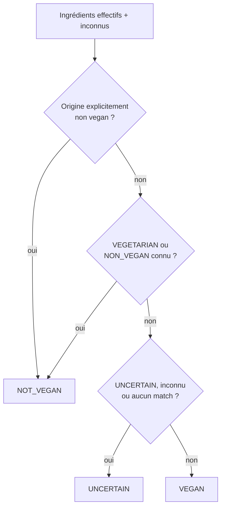

# Moteur de verdict

`VeganAnalyzer` rassemble les correspondances, applique les qualifications d’origine, collecte les inconnus puis délègue l’agrégation à `VerdictEngine`. L’analyse parcourt tous les tokens ; `stoppedAtNonVegetarian` vaut actuellement toujours `false` afin que le diagnostic conserve tous les bloqueurs et inconnus.

## Deux résultats complémentaires

`AnalysisResult.veganAssessment` représente la compatibilité vegan :

`AnalysisResult.verdict` produit une classification détaillée avec cette priorité :

| Priorité | Condition | `AnalysisVerdict` |
|---:|---|---|
| 1 | au moins un statut `NON_VEGAN` | `NON_VEGETARIAN` |
| 2 | au moins un statut `UNCERTAIN` | `UNCERTAIN` |
| 3 | au moins un inconnu ou aucun ingrédient considéré | `INCONCLUSIVE` |
| 4 | au moins un statut `VEGETARIAN` | `VEGETARIAN` |
| 5 | tous les ingrédients considérés sont `VEGAN` | `VEGAN` |

Cette différence est intentionnelle. Par exemple, « lait + mot inconnu » reste `NOT_VEGAN` sur l’axe vegan, mais le verdict détaillé est `INCONCLUSIVE` car l’inconnu empêche une classification complète. Un ingrédient `NON_VEGAN` gagne en revanche même en présence d’inconnus et d’incertains.

## Verdict sans les incertains

`verdictWithoutUncertain` rappelle `VerdictEngine.evaluate` en excluant les ingrédients au statut `UNCERTAIN`. Les inconnus restent présents. Il répond à la question : « que sait-on du reste de la composition si les ingrédients d’origine variable sont mis de côté ? » Il ne transforme jamais un inconnu en vegan.

## Qualifications d’origine

Une qualification active peut remplacer le statut d’une entrée incertaine par `VEGAN`, `VEGETARIAN` ou `NON_VEGAN`. Si une origine est explicitement non vegan mais ne permet pas de décider si elle est végétarienne, `originNonVeganIngredientIds` force `veganAssessment = NOT_VEGAN` alors que le statut effectif peut rester `UNCERTAIN`. Le diagnostic expose le statut de base, le statut effectif et l’explication.

## Présence réelle et absence de liste

En mode `FULL_LABEL` ou `OCR_LABEL`, aucun arbre n’est construit sans titre d’ingrédients reconnu. `availability` vaut alors `NO_INGREDIENT_LIST` et `verdict`/`verdictWithoutUncertain` valent `null`.

Une section autonome « contient » est néanmoins parsée séparément. Ses correspondances alimentent `matched`, `declaredPresenceIngredientIds` et `veganAssessment`, mais ne créent pas artificiellement une liste d’ingrédients complète.

## Traces

Les traces ne sont pas des tokens. Elles sont copiées dans `crossContactWarnings`, affichées après le résultat par `CrossContactNotice` et exportées dans les diagnostics. Elles ne modifient aucun des deux verdicts.

## Cohérence de l’affichage actif

`OcrFirstScreenResult.render` utilise `AnalysisResult.verdict` pour le message principal et ajoute les inconnus/raisons pertinentes. Les branches sont :

- `NON_VEGETARIAN` → « NON VEGAN » ;
- `UNCERTAIN` → « INCERTAIN » ;
- `INCONCLUSIVE` → « INCONCLUS » ;
- `VEGETARIAN` → « VÉGÉTARIEN » ;
- sinon → « VEGAN ».

Le composable hérité `IsItVeganScreen`, non appelé par `MainActivity`, affiche en plus les deux axes côte à côte. Les diagnostics restent la source la plus complète pour comprendre les cas où compatibilité vegan et classification détaillée divergent.

